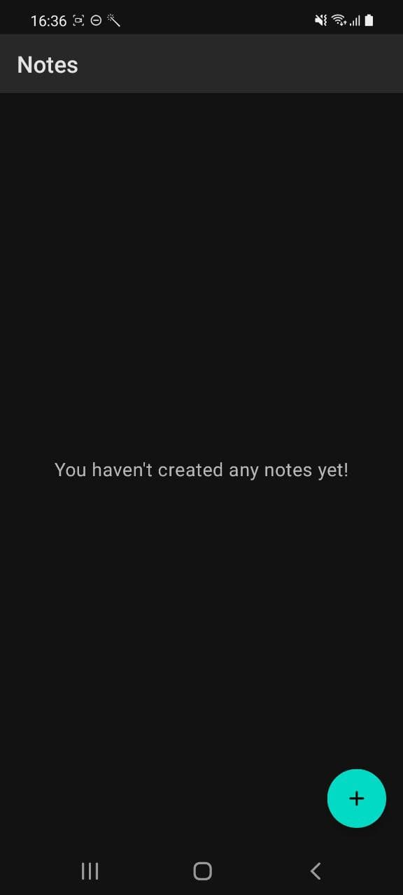
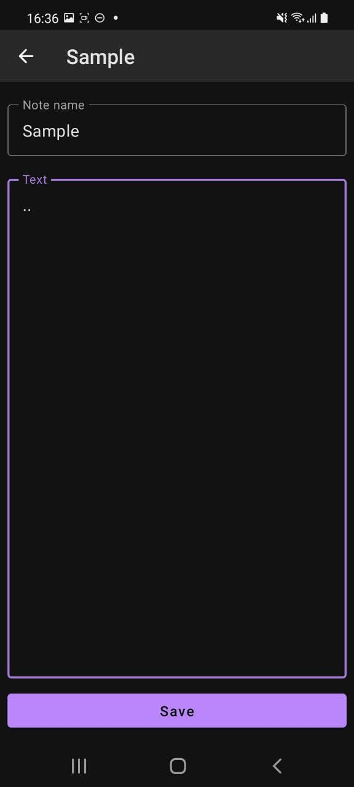
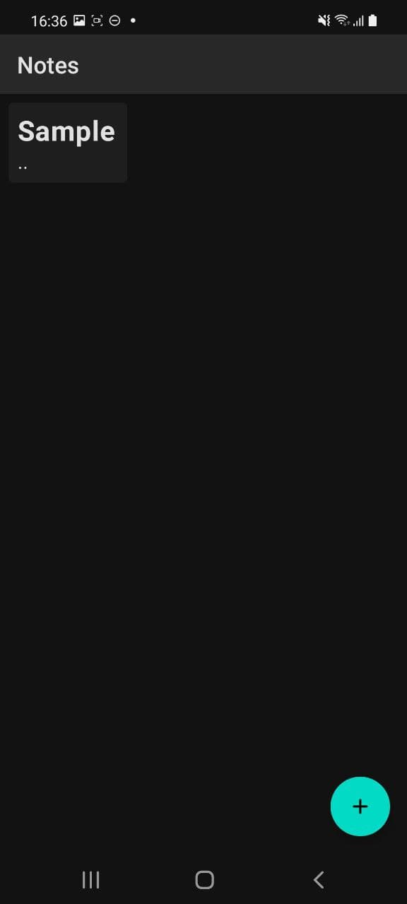
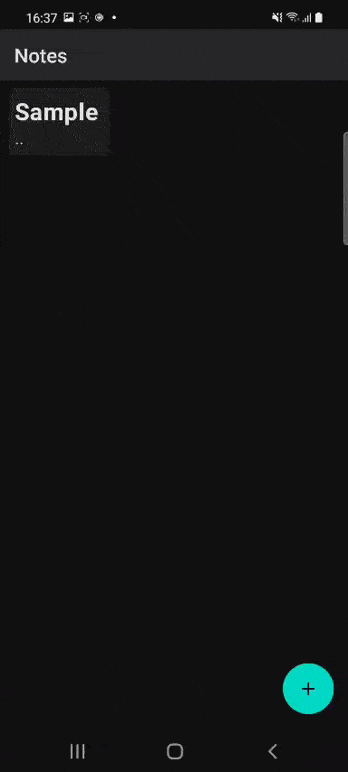

   

# Notes

Simple application made using Compose Multiplatform, SQLDelight and Decompose.

### Screenshots:

|  |  |  |
|----------------------------------------------------------|--------------------------------------|---------------------------------------------------|

### Video:

## TODO

There is plans for adding next stuff:

- Text formatting
- Animations for screen changing